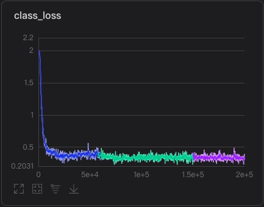
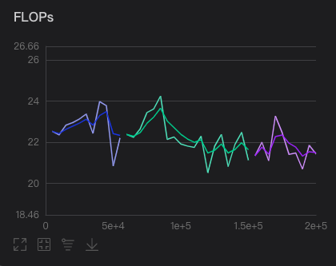
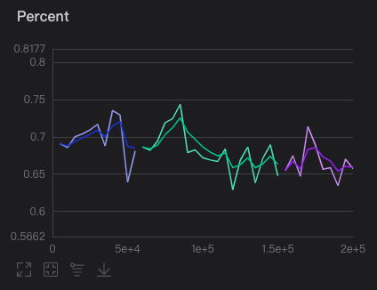
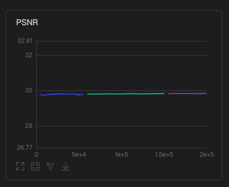

# ClassSR_paddle

ClassSR: A General Framework to Accelerate Super-Resolution Networks by Data Characteristic.

[Paper](https://openaccess.thecvf.com/content/CVPR2021/papers/Kong_ClassSR_A_General_Framework_to_Accelerate_Super-Resolution_Networks_by_Data_CVPR_2021_paper.pdf)

作者: Xiangtao Kong, [Hengyuan Zhao](https://github.com/zhaohengyuan1), [Yu Qiao](https://scholar.google.com/citations?user=gFtI-8QAAAAJ&hl=zh-CN), [Chao Dong](https://scholar.google.com.hk/citations?user=OSDCB0UAAAAJ&hl=zh-CN)

Paddle 复现版本

## 数据集

分类之后训练集用于训练SR模块
https://aistudio.baidu.com/aistudio/datasetdetail/106261
## aistudio
脚本任务地址: https://aistudio.baidu.com/aistudio/clusterprojectdetail/2356381
## 训练模型
链接：https://pan.baidu.com/s/1jf0UKI_wf7yRhwdA4AU5Kw 
提取码：u9lr
## 训练步骤
### train sr
```bash
python train.py -opt config/train/train_RCAN.yml
```
### train ClassSR
```bash
python train_ClassSR.py -opt config/train/train_ClassSR_RCAN.yml
```
多卡仅需
```bash
python -m paddle.distributed.launch train.py --launcher fleet -opt config_file_path
python -m paddle.distributed.launch train_ClassSR.py --launcher fleet -opt config_file_path
```
## 测试步骤
```bash
python test.py -opt config/test/test_RCAN.yml
```
```bash
python test_ClassSR.py -opt config/test/test_ClassSR_RCAN.yml
```
## 实验结果
### class loss

### FLOPs

### Percent

### PSNR

## 复现指标

|      | PSNR  | FLOPs | Percent |
| ---- | ----- | ------------------ | ------------ |
| 论文  | 26.39 | 21.22     | 65% |
| Paddle  | 26.35 | 21.37     | 65.5% |
## 参考资料
- [Xiangtaokong/ClassSR](https://github.com/Xiangtaokong/ClassSR)